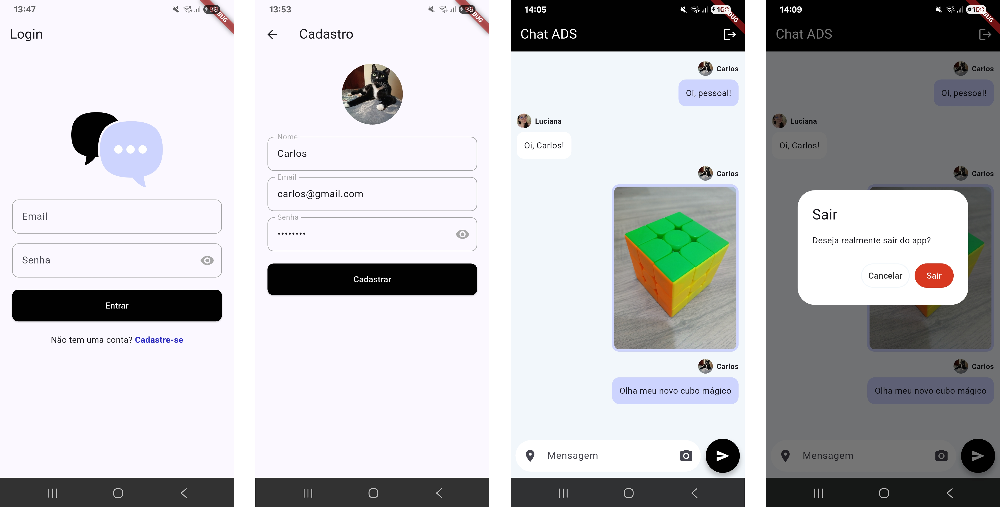

# Chat ADS

Um aplicativo de chat básico feito com Flutter, utilizando Firebase para autenticação e banco de dados. Permite enviar mensagens de texto, imagens e localização.



## Tecnologias utilizadas

- **Flutter** – framework para desenvolvimento mobile.
- **Firebase Auth** – autenticação de usuários.
- **Cloud Firestore** – banco de dados em tempo real para armazenar mensagens e usuários.
- **Cloudinary** – serviço para upload e hospedagem de imagens.
- **Image Picker** – captura de imagens da câmera ou galeria.
- **Geolocator** – captura da localização do usuário.
- **URL Launcher** – abre links externos, usado para links de localização.

## Dependências

- `firebase_auth`: autenticação de usuários.
- `cloud_firestore`: banco de dados em tempo real.
- `firebase_core`: inicialização do Firebase.
- `image_picker`: captura de imagens.
- `http` / `http_parser` / `mime`: upload de imagens para Cloudinary.
- `geolocator`: localização do usuário.
- `url_launcher`: abertura de links externos.
- `cupertino_icons`: ícones padrão do iOS.

## Como executar?

Clone o repositório:

```sh
git clone https://github.com/almeidaluciana/chat-ads.git
```

Acesse a pasta do projeto:

```sh
cd todo_app
```

Baixe as dependências do Flutter:

```sh
flutter pub get
```

Abra o projeto no VS Code:

```sh
code .
```

Execute o aplicativo com **Ctrl + F5**, você deverá escolher em qual dispositivo deseja rodar o projeto (emulador ou dispositivo físico).
